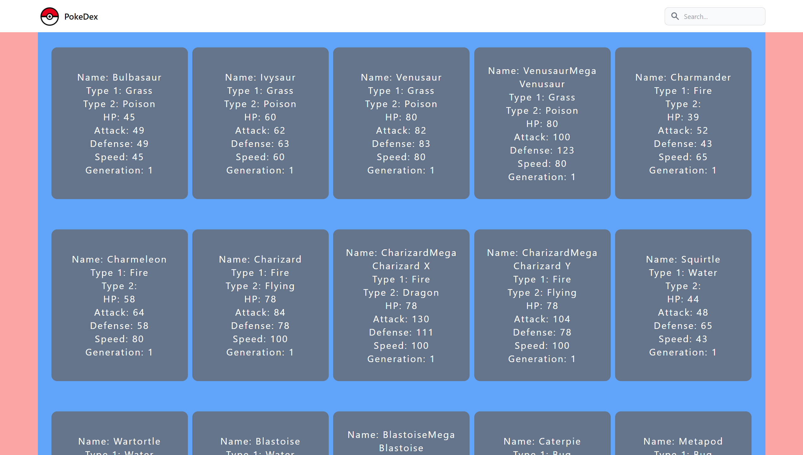

## Available Scripts

In the project directory, you can run:

### `npm run dev`

Runs the app in the development mode.\
Open [http://localhost:3000](http://localhost:3000) to view it in your browser.\
Open [http://localhost:5000/api/pokemons](http://localhost:5000/pokemons) to view the server output.\
Open [http://localhost:5000/api/pokemons/:name](http://localhost:5000/pokemons/:name) to view the server output of a specified pokemon.

The page will reload when you save changes.\
You may also see any lint errors in the console.

### `npm run server`

Runs the server only, which you can utilize as a RESTful resource.

### `npm run client`

Runs the react client app only.

### `npm run build`

Builds the app for production to the `build` folder.\
It correctly bundles React in production mode and optimizes the build for the best performance.\

